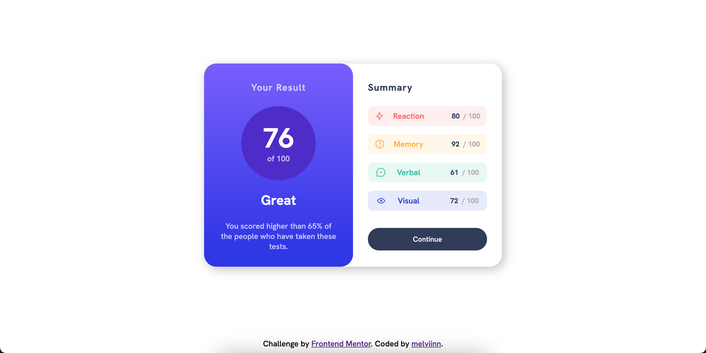
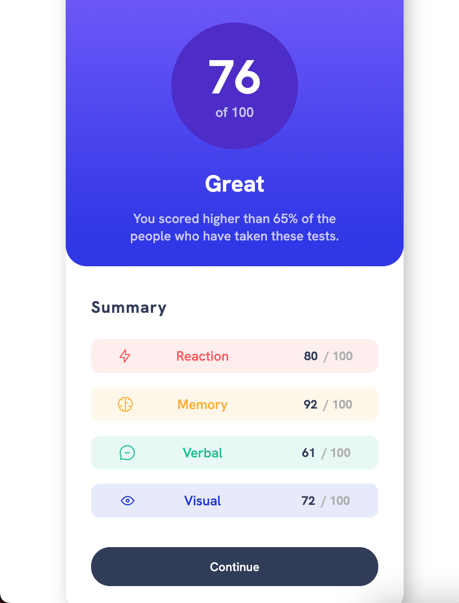

# Frontend Mentor - Results summary component solution

This is a solution to the [Results summary component challenge on Frontend Mentor](https://www.frontendmentor.io/challenges/results-summary-component-CE_K6s0maV). Frontend Mentor challenges help you improve your coding skills by building realistic projects.

## Table of contents

  - [Links](#links)
  - [My process](#my-process)
    - [Built with](#built-with)
  - [Author](#author)

## Links

- Solution URL: [melviinn/product-preview-card-component](https://www.frontendmentor.io/solutions/qr-code-challenge-SyH5p78QuX)
- Live Site URL: [product-preview-card-component.vercel.app](https://product-preview-card-component-six-chi.vercel.app/)

## My process

  ### Built with

- Semantic HTML5 markup
- CSS custom properties
- Flexbox
- Grid templates

## Author

- Github - [melviinn](https://github.com/melviinn)
- Frontend Mentor - [@melviinn](https://www.frontendmentor.io/profile/melviinn)
- Instagram - [@_melviin.dch](https://www.instagram.com/_melviin.dch/?hl=fr)